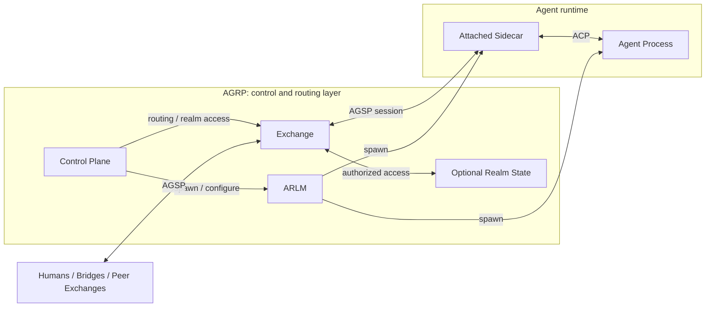
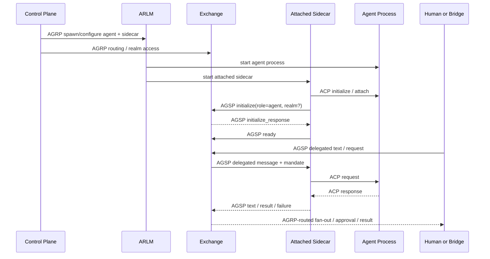

# Agent Relay Protocol (AGRP)
## RFC Draft — Switching Fabric and Realm Infrastructure for Agent Meshes

**Status:** Draft  
**Intended Status:** Informational  
**Date:** March 2026  
**Working Group:** Agent-Relay-Protocol / working-draft
**Author:** Aleksei Kudriashov <akud.soft@gmail.com>

---

## Table of Contents

- [Why This RFC Exists](#why-this-rfc-exists)
- [High-Level Exchange View](#high-level-exchange-view)
- [Abstract](#abstract)
- [1. Problem Statement](#1-problem-statement)
- [2. Core Concepts](#2-core-concepts)
- [3. Architecture](#3-architecture)
- [4. AGRP Session Protocol (AGSP)](#4-agrp-session-protocol-agsp)
- [5. Realm Lifecycle](#5-realm-lifecycle)
- [6. Control Plane State Model](#6-control-plane-state-model)
- [7. Agent Addressing](#7-agent-addressing)
- [8. Audit Log](#8-audit-log)
- [9. Exchange-to-Exchange Communication](#9-exchange-to-exchange-communication)
- [10. Mesh of Meshes (Federation)](#10-mesh-of-meshes-federation)
- [11. Relationship to Kubernetes](#11-relationship-to-kubernetes)
- [12. Relationship to Adjacent Protocols](#12-relationship-to-adjacent-protocols)
- [13. Open Questions](#13-open-questions)
- [14. Out of Scope](#14-out-of-scope)
- [15. References](#15-references)
- [Contributors](#contributors)

---

## Why This RFC Exists

For a non-technical reader, AGRP is a shared switchboard for human and agent work. It exists so one realm can:

- connect people from chat, terminal, and IDE clients
- connect agents working on the same task
- route messages, approvals, and results in one place
- keep audit history and realm lifecycle under one control plane
- link trusted realms together when work must cross boundaries

Without AGRP, the current protocol stack solves individual links such as editor-to-agent or agent-to-tool communication, but not the shared realm fabric around them. This RFC defines that missing layer.

```
 [People]
    |
 [Chat / CLI / IDE]
    |
 [Exchanges with Realm Access] ---- trusted links ---------------- [Other Realms]
    | \
    |  +--> [Realm State]
    |        +--> [Agent Sidecars + Agents]
    |        +--> [Files / Context / Resources]
    |        +--> [Audit Log]
    |
 [Control Plane] -------------------------------> [Exchange Access Mapping]
 [Control Plane] -------------------------------> [Create / Pause / Resume / Route]
```

## High-Level Exchange View

At runtime, AGRP centers work around Exchanges. A Realm is an optional stateful attachment that the Control Plane may bind to one or more Exchanges. Humans and bridges connect to a specific authorized Exchange, the Control Plane and ARLM manage lifecycle around any shared realm state when present, and every agent is represented through a 1:1 attached sidecar. The sidecar speaks AGSP, receives delegated requests plus signed mandates, and invokes or polls the passive agent locally.

```
 [Human User] ------------------------------------------------\
 [Human Channel] -- bridge session ---------------------------+--> [Authorized Exchange A]
 [Peer Exchange / Federated Link] -- trusted AGSP link -----------/
                                                              |
 [Control Plane] -- routing + policy + realm access --------> [Authorized Exchange B]
 [Control Plane] -- spawn / suspend / resume -----------> [Agent Runtime Lifecycle Manager]
                                                              |
 [Authorized Exchange A] -- authorized access -----------> [Realm State]
 [Authorized Exchange B] -- authorized access -----------> [Realm State]
 [Realm State] ------------------------------------------> [Audit Log]

 [Authorized Exchange A] -- delegated text + signed mandate -> [Sidecar: agent1] -- ACP --> [Agent Process 1]
 [Authorized Exchange B] -- delegated text + signed mandate -> [Sidecar: agent2] -- ACP --> [Agent Process 2]
 [Authorized Exchange A] -- resource_call -------------------> [Environment / Resource Service]

 [Agent Runtime Lifecycle Manager] -- spawns + resumes -----> [Sidecar: agent1]
 [Agent Runtime Lifecycle Manager] -- spawns + resumes -----> [Sidecar: agent2]
 [Agent Runtime Lifecycle Manager] -- provisions -----------> [Environment / Resource Service]
```

---

## Abstract

This document specifies the Agent Relay Protocol (AGRP), a switching fabric and realm infrastructure for autonomous agent meshes. AGRP defines how agents, humans, and AGSP bridges connect through Exchanges; how optional Realms add shared state and lifecycle; how a Control Plane manages topology, realm lifecycle, and routing state; and how inter-Exchange communication enables multi-hop meshes.

AGRP operates at the **communication and infrastructure layer** — below the semantics of agent collaboration (A2A) and above the mechanics of tool access (MCP) and editor integration (ACP). It provides the managed topology, optional realm lifecycle, and message routing that these protocols do not address.

AGRP is to agent meshes what a telephone switching network is to voice communication: a universal, topology-agnostic fabric that routes messages between participants without knowledge of their content.

---

## 1. Problem Statement

AI agents increasingly operate in multi-agent, multi-human systems. Several protocols have emerged to address different layers of the agentic stack, most now maturing under open governance. However, none define a **switching fabric** — a managed infrastructure where agents and humans are organized through Exchanges and optional Realms, connected by routable topology, with lifecycle management, audit, and multi-client access.

### 1.1 Protocol Landscape

| Protocol | Scope | What It Solves |
|---|---|---|
| **MCP** (Model Context Protocol) | Agent ↔ Tools/Data | Standardized access to external tools, data sources, and resources. |
| **ACP** (Agent Client Protocol) | Editor ↔ Agent | Editor-to-agent communication, session management, and interactive coding workflows. |
| **A2A** (Agent2Agent Protocol) | Agent ↔ Agent | Peer-to-peer agent collaboration, capability discovery, and task exchange. |
| **AGENTS.md** | Agent ↔ Repository | Repository-local instructions and behavioral guidance for agents. |

### 1.2 The Gap

None of these protocols address:

- **Managed topology** — how agents are grouped through Exchanges and optional Realms with shared environments, routed across Exchanges, connected via a control plane
- **Multi-client access** — how the same Exchange or Realm is accessed simultaneously from a terminal, a messaging app, and an IDE
- **Realm lifecycle** — how a stateful collaborative unit (code + agent + humans) is created, suspended, resumed, and audited when a Realm is present
- **Multi-hop relay** — how a message traverses multiple Exchanges without hardcoded addressing
- **Broadcast and fan-out** — how an agent's response reaches all human participants sharing an Exchange or Realm context

MCP connects agents to tools. ACP connects editors to agents. A2A enables agent-to-agent collaboration. **AGRP provides the infrastructure mesh beneath all of them.**

### 1.3 Position in the Agentic Stack

```
┌─────────────────────────────────────────────────┐
│  Application Layer                              │
│  (Agent business logic, task orchestration)      │
├─────────────────────────────────────────────────┤
│  A2A — Agent-to-agent collaboration             │
│  (Task lifecycle, Agent Cards, negotiation)      │
├─────────────────────────────────────────────────┤
│  AGRP — Switching Fabric + Realms            │
│  (Exchanges, routing, lifecycle, audit)  ◄── THIS   │
├─────────────────────────────────────────────────┤
│  AGSP — AGRP Session Protocol                     │
│  (JSON-RPC sessions, envelopes, heartbeat)       │
├─────────────────────────────────────────────────┤
│  Transport (gRPC / WebSocket / TCP)             │
├─────────────────────────────────────────────────┤
│  MCP — Tool & Data Access    (orthogonal)       │
│  ACP — Editor Integration    (orthogonal)       │
└─────────────────────────────────────────────────┘
```

---

## 2. Core Concepts

### 2.1 Agent

An agent is a logical autonomous worker addressed by name within the mesh; resolution is handled by the Exchange and Control Plane.

In AGRP v1, every agent participates through a **1:1 attached sidecar** that connects to the Exchange, speaks ACP to its parent agent, and emits AGSP messages on the agent's behalf. The sidecar is an implementation detail of the agent runtime and is not exposed to users as a separate participant identity.

An agent is instantiated with a **harness** — a configuration bundle specifying the model, provider, tools, skills, and behavioral constraints. The harness is opaque to the protocol; AGRP treats it as metadata stored in the Control Plane and passed to the Agent Runtime Lifecycle Manager at spawn time.

AGRP reaches the agent through ACP on the attached sidecar. MCP and A2A may still be used by the agent for tool access and collaboration, but they are orthogonal to the Exchange-facing AGRP/AGSP path.

### 2.1.1 Agent Sidecar

An agent sidecar is a child transport adapter managed alongside exactly one agent by the ARLM or realm runtime. The sidecar:

- Terminates AGSP on behalf of its parent agent
- Translates between AGSP and ACP
- Uses ACP to deliver delegated requests to the agent and receive replies, protocol-level requests that need Exchange mediation, and failures
- Verifies received signed mandates and enforces them locally on delegated requests

Agents do not speak AGSP directly in v1. They interact with the mesh only through ACP on their attached sidecar.

### 2.2 Exchange

An Exchange is a process or pod that acts as a **switching node** in the mesh. It is the fundamental routing unit of the AGRP fabric. An Exchange:

- Accepts AGSP connections from agent sidecars, humans, AGSP bridges, and peer Exchanges
- Maintains a local routing table pushed by the Control Plane
- Forwards messages to local participants or to peer Exchanges
- Broadcasts messages within its local participant set, or within a realm according to realm fan-out rules when the Exchange is bound to a Realm
- May persist messages to an append-only audit log when serving a Realm with persistence enabled
- Is itself an AGSP participant — it can join other Exchanges as a peer

This last property is the key architectural insight: **Exchange-to-Exchange communication uses the same AGSP protocol as any other participant connection**. There is no separate inter-Exchange protocol. An Exchange joins another Exchange exactly as any external participant would, enabling recursive composition.

### 2.3 Realm

A Realm is AGRP's **managed, stateful collaboration unit**. It is optional: an Exchange may run without any Realm, in which case it behaves as a stateless relay or chat surface without protocol-required history persistence. A Realm bundles:

- **Shared realm state** — mutable state and policy owned by the Realm
- **An Environment Resource Service** — an abstract provider of context, environment resources, and realm information
- **Agents** — one or more, each with a harness and model configuration
- **Members** — humans with roles (owner, admin, member) and permissions
- **Channels** — bindings to external systems (Telegram threads, Slack channels, etc.) via AGSP bridges
- **Audit log** — append-only record of all messages, approvals, and operations

A Realm has a hierarchical identifier: `{namespace}/{name}` (e.g., `myns/myproject`). Realms are managed by the Control Plane and have a defined lifecycle: `creating → running → suspended → running → terminated`.

The relationship between Realm and Exchange is strict but indirect: a Realm owns identity, mutable state, and lifecycle, while Exchanges are separate switching nodes that may be granted access to that Realm by the Control Plane. An Exchange handles switching and policy enforcement for the traffic that enters through it, but it does not define the Realm and is not declared by the Realm object itself. The Control Plane may grant multiple Exchanges access to the same Realm for availability, locality, or load distribution. Multiple Realms may run on the same physical infrastructure but their state and policy boundaries remain logically isolated.

From an implementation point of view, a Realm may be realized as a stateful runtime unit, for example a Kubernetes StatefulSet pod with attached persistent storage such as a PVC. This RFC does not require Kubernetes or PVCs, but it does require the same semantics: the Realm owns mutable state together with a controlled interface for reading and mutating that state.

Realm state is not modified by arbitrary participant traffic. In base AGRP, Realm state changes happen only through two paths:

1. Control Plane commands that create, suspend, resume, terminate, or reconfigure the Realm
2. Exchange-mediated operations that satisfy realm-local roles, mandate scope, and approval policy before the Exchange proxies them to the Environment/Resource service or other authorized realm-local handlers

This RFC intentionally keeps the internal state layout abstract. Concrete resource schemas, storage formats, and mutation interfaces are left to a separate companion Environment/Resource RFC.

### 2.4 AGSP Bridge

An AGSP Bridge is an AGSP participant that translates between an external protocol and AGSP. From the Exchange's perspective, a bridge is just another participant — the Exchange does not know or care that it is backed by Telegram, Slack, or any other system.

Examples:

| Bridge | External Protocol | AGSP Role |
|---|---|---|
| Telegram Bridge | Telegram Bot API (thread-bound) | `bridge` |
| Slack Bridge | Slack Events API (channel-bound) | `bridge` |
| CLI Client | Native AGSP over WebSocket | `human` (direct, no bridge needed) |
| IDE / File Mount | FUSE + AGSP sidecar | `bridge` |

A bridge registers with the Exchange using role `bridge` and declares metadata about the external channel it represents. Messages flowing through a bridge carry the original author's identity, not the bridge's.

### 2.5 Control Plane

The Control Plane is a Raft-replicated cluster responsible for:

- **Realm lifecycle** — create, suspend, resume, terminate realms
- **Topology management** — tracking all Exchanges, agents, bridges, and inter-Exchange links
- **Routing state distribution** — pushing routing tables to Exchanges via xDS-style streaming
- **Agent lifecycle** — managing spawn/terminate of agents and their attached sidecars via the Agent Runtime Lifecycle Manager
- **Membership and authorization** — enforcing realm-local roles (`owner`, `admin`, `member`) and optional opaque IAM payloads on sessions and mandates
- **Cluster federation** — managing inter-cluster links for mesh-of-meshes

The Control Plane is **not** in the data path. It configures routing state, but message forwarding happens directly between Exchanges. If the Control Plane becomes temporarily unavailable, Exchanges continue forwarding using their last known routing state — providing **fault tolerance by design**. Base authorization in AGRP is realm-local; deployments may attach opaque IAM payloads to sessions and mandates for policy enrichment, but this RFC does not standardize their schema. Direct resource targeting is restricted to `owner` and `admin` members in base AGRP and is proxied by the Exchange to the Environment/Resource service.

### 2.6 Agent Runtime Lifecycle Manager (ARLM)

An abstraction over execution environments (Kubernetes, native-fork, serverless, etc.) that the Control Plane uses to:

- Spawn and terminate agents and their attached sidecars (with harness configuration)
- Provision and destroy environment resources
- Suspend and resume environment/resource handles

The ARLM is pluggable — the protocol is agnostic to the underlying runtime. The ARLM connects to Exchanges as an AGSP participant with role `arlm`.

---

## 3. Architecture

### 3.1 Layered Model

AGRP defines three planes:

| Plane | Components | Analogy |
|---|---|---|
| **Orchestration Plane** | Control Plane (Raft) | k8s API Server + etcd |
| **Switching Fabric** | Exchanges + AGSP relay + Bridges | kube-proxy + CNI |
| **Runtime Plane** | ARLM (k8s, fork, etc.) + Agents + Sidecars + Environment Resources | kubelet + container runtime |

### 3.2 Realm Topology (Single Realm)

A typical realm with CLI, Telegram, and a single agent:

```
                     [Control Plane]
                          |
                    manage lifecycle
                          |
 [CLI] ── AGSP ──→ [  Exchange  ] ←── AGSP ── [Telegram Bridge]
                      ↑   ↑                |
                      |   |                |
                      |   +──── AGSP ── [File Mount Bridge]
                      |                     |
                      |               [FUSE → ~/relay/ns/proj]
                      |
                   AGSP via
                 attached sidecar
                      |
               [Sidecar: claude]
                      |
                    ACP
                      |
                [Agent: claude]
```

All external Exchange edges in this example are AGSP sessions. The agent process is not. The Exchange talks to the agent through its attached sidecar, and the sidecar talks to the local agent over ACP. When the agent produces a reply over ACP, the sidecar emits the corresponding AGSP message and the Exchange fans it out to CLI and both bridges. When a human types in the Telegram thread, the bridge forwards it as an AGSP message attributed to that human; if the message has no explicit agent target, the Exchange stores it as an `exchange_message` in the local transcript/history when enabled.

### 3.2.1 Agent Attachment and Join Flow

The protocol layers are intentionally split:

- **AGRP** is the overall system layer: Control Plane, Exchange, routing, realm access, policy, audit, and lifecycle.
- **AGSP** is the session protocol used when the sidecar joins the Exchange and when the Exchange exchanges messages with humans, bridges, peer Exchanges, and ARLM.
- **ACP** is the local sidecar-to-agent protocol. It is not spoken on the Exchange wire.





Join and interaction flow in base AGRP v1:

1. The Control Plane tells the ARLM to start the agent and its attached sidecar.
2. The sidecar establishes an ACP session with the agent process.
3. The sidecar joins the Exchange over **AGSP** with role `agent` and optional `realm`.
4. The Exchange returns session metadata, capabilities, and the current routing snapshot.
5. Humans, bridges, or peer Exchanges send AGRP-routed messages to the Exchange; the Exchange delivers delegated work to the sidecar over **AGSP**.
6. The sidecar forwards delegated work to the agent over **ACP**.
7. The agent replies over **ACP**; the sidecar translates that reply back into **AGSP** and sends it to the Exchange for routing, fan-out, approvals, or resource mediation under **AGRP** rules.

### 3.3 Multi-Exchange Topology

Across multiple realms and Exchanges, the mesh topology is a **configuration**, not code. The Control Plane defines which Exchanges connect to which. Any topology can be expressed: hub-and-spoke, tree, ring, full mesh, or hierarchical.

```
[Control Plane (Raft cluster)]
         |
   push routing tables
         |
   +------+------+
   |             |
[Exchange A]      [Exchange B]
  ws: myns/    ws: myns/
  myproject    infra
  |    \      /    |
[ag1] [ag2]-[ag3] [ag4]
```

### 3.4 Routing Table Distribution (xDS Model)

When an agent is spawned in Exchange B, the Control Plane:

1. Updates global state (Raft-committed)
2. Streams routing table update to all affected Exchanges via persistent gRPC/WebSocket
3. Exchanges update their local forwarding table atomically

Exchanges forward messages autonomously using their local table. If the Control Plane becomes temporarily unavailable, Exchanges continue forwarding with their last known state.

---

## 4. AGRP Session Protocol (AGSP)

### 4.1 Design Principles

AGSP is AGRP's native session protocol. It is a bidirectional JSON-RPC 2.0 protocol that runs over gRPC, WebSocket, or raw TCP. AGSP is purpose-built for Exchange-based switching with:

- **Connection initialization** with capability negotiation
- **Session multiplexing** — multiple logical sessions over one connection
- **Envelope-based messaging** with source/destination addressing
- **Broadcast and fan-out** — addressing groups of participants by role
- **Streaming notifications** for routing table updates and session events
- **Heartbeat and liveness** detection

AGSP borrows design principles from ACP (JSON-RPC 2.0, capability negotiation, streaming updates) and A2A (HTTP/gRPC transport, structured task messages), but is purpose-built for relay semantics. Neither ACP nor A2A support multi-hop forwarding, routing tables, or Exchange-based switching.

This document provides the architectural and behavioral model for AGSP. The normative method catalog, error codes, and wire schemas are intended to live in a separate companion AGSP RFC.

### 4.2 Connection Lifecycle

```
Participant                          Exchange
    |                                  |
    |─── agsp/initialize ─────────────→|
    |    { protocol_version,           |
    |      role,                       |
    |      participant_info,           |
    |      capabilities,               |
    |      realm? }                |
    |                                  |
    |←── initialize_response ─────────|
    |    { exchange_info,                  |
    |      capabilities,               |
    |      members,                    |
    |      routing_snapshot }          |
    |                                  |
    |─── agsp/ready ──────────────────→|
    |                                  |
    |⇐⇒  Bidirectional messaging  ⇐⇒ |
```

The `role` field indicates participant type:

| Role | Description |
|---|---|
| `agent` | Logical AI agent represented by an attached sidecar |
| `human` | Human user (direct CLI/WebSocket connection) |
| `bridge` | Client bridge translating an external protocol |
| `exchange` | Peer Exchange (inter-Exchange link) |
| `arlm` | Agent Runtime Lifecycle Manager |

Exchanges treat all roles uniformly for message forwarding. The role is metadata for fan-out rules, observability, and authorization policy — not routing. The attached sidecar is modeled as an internal child session, but the Exchange projects it as the parent logical `agent` participant. Because every agent is sidecar-backed in AGRP v1, transport-mode negotiation is not required in AGSP session setup.

The `realm` field in `agsp/initialize` is optional. It is present when the session is bound to a managed Realm and omitted for standalone stateless Exchanges.

### 4.3 Message Envelope

All messages routed through AGRP use a common envelope:

```json
{
  "jsonrpc": "2.0",
  "method": "agsp/message",
  "params": {
    "id": "msg-uuid-001",
    "from": "user1",
    "to": "claude",
    "type": "text",
    "ttl": 8,
    "payload": {
      "text": "add zod schemas for all endpoints"
    }
  }
}
```

Fields:

| Field | Required | Description |
|---|---|---|
| `id` | yes | Unique message identifier (UUID) |
| `correlation_id` | correlated flows only | Shared identifier linking related request, chunk, result, end, and approval messages |
| `from` | yes | Sender identity (agent name, human username, bridge ID) |
| `to` | except `exchange_message` | Destination: local agent name, `agrp://namespace/realm/agent`, `resource://namespace/realm/resource`, `*` for broadcast, or `role:...` for role-based fan-out |
| `source_realm` | cross-realm only | Source realm identifier (`namespace/name`) |
| `destination_realm` | cross-realm only | Destination realm identifier (`namespace/name`) |
| `exchange_src` | inter-Exchange forwarding only | Identifier of the Exchange that last forwarded the envelope, used for traceability and trust decisions |
| `mandate` | delegated sidecar and direct resource requests | Inline signed claim object issued and signed by the current Exchange for local enforcement, always including an expiry |
| `type` | yes | Message type (see §4.4) |
| `ttl` | yes | Time-to-live, decremented at each Exchange hop. Dropped at 0. |
| `payload` | yes | Opaque to AGRP. Application-level content. |

For same-realm traffic bound to a single session realm, `source_realm` and `destination_realm` MAY be omitted. When omitted, the Exchange resolves both values from the session realm context. For sessions not bound to any Realm, both fields MUST be omitted. For cross-realm traffic, both fields MUST be present. During inter-Exchange forwarding, `exchange_src` MUST be present and identify the forwarding Exchange that placed the envelope on the current Exchange-to-Exchange hop. AGSP field names shown in this RFC use `snake_case`. At minimum, a signed `mandate` binds the subject, any applicable realm identifier, resource scope, and expiry, where scope is either an explicit resource set or `*` for all resources in scope. Related `resource_call`, `resource_chunk`, `resource_result`, `resource_end`, and approval messages reuse the same `correlation_id`.

### 4.4 Message Types

| Type | Direction | Description |
|---|---|---|
| `text` | any → any | Targeted plain text or markdown message |
| `exchange_message` | human/bridge → exchange | Untargeted human message appended to local exchange transcript/history when enabled and not delivered to agents |
| `resource_call` | human/agent → exchange | Direct resource request routed by the Exchange to the Environment/Resource service |
| `resource_result` | exchange → requester | Final or single response for a direct resource request |
| `resource_chunk` | exchange → requester | Streaming chunk for a direct resource request when realm policy enables streaming |
| `resource_end` | exchange → requester | Explicit end-of-stream marker for a streamed direct resource request |
| `approval_request` | exchange → role:human | Request for human approval with risk level and action description |
| `approval_response` | human → exchange | Approve or deny, with approver identity |
| `approval_denied` | exchange → requester | Explicit notice that approval was denied under realm policy or by human decision |
| `delivery_failure` | exchange → original sender | Explicit notice that delivery or forwarding failed |
| `session_event` | exchange → all | Participant joined, left, or changed status |
| `routing_update` | cp → exchange | Routing table push (Control Plane to Exchange only) |

The `payload` field carries type-specific content. AGRP routes all types identically — the type field exists for client rendering and policy enforcement, not for routing decisions. AGRP does not define low-level agent execution contracts such as tool invocation or tool result messages. Approval messages in base AGRP are emitted only by the Exchange for Exchange-mediated policy gates and are not a generic agent UI primitive. For `resource_call`, the Exchange acts as a policy-enforcing proxy to the Environment/Resource service.

### 4.5 Broadcast and Fan-out

An Exchange implements the following fan-out rules:

- **`to: "agent-name"`** — deliver to the named participant within the current Exchange scope
- **`to: "agrp://namespace/realm/agent"`** — deliver to the canonical remote participant identified by the canonical agent URI
- **`to: "resource://namespace/realm/resource"`** — route a direct resource request through the Exchange to the Environment/Resource service
- **`to: "*"`** — deliver to all participants in the current Exchange scope
- **`to: "role:human"`** — deliver to all participants with role `human` or `bridge` (bridges represent human channels)
- **`to: "role:agent"`** — deliver to all participants with role `agent`

If the session is realm-bound, the current Exchange scope is the current Realm. Otherwise it is the local standalone Exchange participant set.

Default behavior: when an agent sends a `text` message without an explicit `to`, the Exchange defaults to `role:human` — the message fans out to all human participants and bridges in the current Exchange scope. This is how a single agent response appears in both CLI and Telegram simultaneously.

When a human or bridge sends a message without an explicit agent target, the Exchange stores it as a `exchange_message` in the local transcript/history when enabled and does not route it to agents. Human-to-agent delivery happens only through explicit delegation.

The `role:agent` form is available for explicit system-level fan-out, but human delegation in multi-agent realms targets a specific agent URI rather than an agent broadcast.

Direct resource targeting uses `resource://namespace/realm/resource` URIs. For human participants it is available only to `owner` and `admin` members in base AGRP. Agents may also target `resource://` URIs, but only through `resource_call`, not through generic `text`.

### 4.6 Delegation

Delegation is not a separate AGSP primitive. A client or bridge delegates by sending a normal `text` message whose `to` field is a specific agent URI such as `agrp://myns/myproject/claude`.

Delegation carries only the selected message content, not an implicit reference to prior exchange history. Delegation targets a single agent, and the base realm default is that any member may delegate unless the realm policy overrides it.

When a human delegates to a realm-managed sidecar agent, the Exchange always attaches an inline signed `mandate` claim that captures the authorized scope for that request. The issuing Exchange signs the mandate, enforces authorization before issuing it, and the attached sidecar verifies the mandate for local enforcement when invoking the passive agent.

In base AGRP v1, mandated delegation targets are realm-managed sidecar agents.

If an agent or sidecar forwards or re-delegates work, the current Exchange must mint and sign a reduced-scope mandate rather than reusing the original mandate unchanged.

### 4.7 Direct Resource Access

Direct resource access is represented as `resource_call` addressed to a `resource://namespace/realm/resource` URI. `resource://` targets are not valid for generic `text` messages in base AGRP. For human callers, the Exchange verifies that the sender is an `owner` or `admin`. For agent callers, the Exchange evaluates the request against the agent's current mandate and realm policy. The Exchange always attaches or propagates a signed mandate, evaluates the separate `resource_approval_policy`, and proxies the request to the Environment/Resource service. When the policy requires human approval, the Exchange emits `approval_request` and applies the resulting `approval_response`; if approval is denied, the Exchange returns `approval_denied` and does not proxy the call. The Environment/Resource service verifies the mandate again before execution. The service response returns to the requester either as a single `resource_result` or as a stream of `resource_chunk` messages terminated by `resource_end`, depending on realm configuration.

Mandate expiry is checked when the `resource_call` is admitted. Once a long-running streamed request has started successfully, it is allowed to finish even if the original mandate would expire during the stream.

Cross-realm `resource_call` is not generally routable in base AGRP. It is allowed only across trusted federated links.

### 4.8 Delivery Failure

If an Exchange cannot route or deliver a message because of missing routes, insufficient link trust claims, queue exhaustion, or TTL expiry, it emits a `delivery_failure` message back to the original sender or upstream Exchange.

### 4.8.1 Approval Denied

If an Exchange-mediated action is rejected by approval policy or by a human approver, the Exchange emits `approval_denied` to the requester and does not perform the underlying action.

### 4.9 Approval Flow

Operations that require human approval follow a structured flow coordinated by the Exchange:

```
Requester                Exchange                    Humans
  |                        |                        |
  |─ operation request ──→|                        |
  |                        |─ approval_request ───→|
  |                        |  { action: "mutating   |
  |                        |    resource access",   |
  |                        |    risk: "high" }      |
  |                        |                        |
  |                        |←── approval_response ──|
  |                        |    { approved: true,    |
  |                        |      approver: "user1" }
  |←─ routed result / ────|                        |
  |   policy decision      |                        |
```

The Exchange enforces realm-level approval policy:

- **Who can approve** — based on member roles (owner, admin)
- **What requires approval** — based on risk classification
- **How many approvals** — single approver or quorum (configurable per realm)

The approval policy is realm metadata managed by the Control Plane. The Exchange enforces it and emits the approval messages defined by AGRP.

Any follow-up execution or completion reporting happens through normal AGRP messages such as `text` or `resource_result`, or through implementation-specific agent-local contracts outside AGRP. If approval is denied, the requester receives `approval_denied`.

For cross-realm operations in v1, approval is governed by the **source realm** policy. The explicit exception is `resource_call`: when a cross-realm `resource_call` is permitted, approval is governed by the destination realm's `resource_approval_policy`. The destination Exchange trusts forwarded approval decisions only when the inter-Exchange link negotiated the required trust claim during connection setup.

---

## 5. Realm Lifecycle

Realm lifecycle describes the runtime envelope around a stable stateful unit. Realm identity and persistent mutable state may outlive any particular Exchange process, agent process, or sidecar session. Lifecycle transitions are commanded by the Control Plane; participant-originated changes flow only through a running Exchange that the Control Plane has configured for Realm access and only when authorized by realm policy.

### 5.1 State Machine

```
           create
    ┌────────────────┐
    │                ▼
    │           ┌─────────┐
    │           │ Creating │
    │           └────┬─────┘
    │                │ environment ready, agent session established
    │                ▼
    │           ┌─────────┐   suspend    ┌───────────┐
    │           │ Running  │────────────→│ Suspended  │
    │           └────┬─────┘             └─────┬──────┘
    │                │                   resume│
    │                │         ┌───────────────┘
    │                │         ▼
    │                │    ┌─────────┐
    │                │    │ Running  │
    │                │    └────┬─────┘
    │                │         │
    │           terminate      │ terminate
    │                │         │
    │                ▼         ▼
    │           ┌──────────────────┐
    └──────────│   Terminated     │
               └──────────────────┘
```

State semantics:

- **Creating** — the Control Plane allocates realm identity, provisions or attaches persistent realm state, and asks the ARLM to start the runtime components. The Realm does not yet admit normal participant traffic.
- **Running** — at least one Exchange with Control-Plane-granted Realm access is live, agents and sidecars may be connected, and authorized Exchange-mediated operations may mutate realm state according to role, mandate, and approval policy. Control Plane commands may still reconfigure or suspend the Realm.
- **Suspended** — persistent realm state is retained, but live compute is released. No Exchange retains active Realm access, channel bindings are inactive, and participant-originated mutations do not run. Only the Control Plane may resume, reconfigure, or terminate the Realm.
- **Terminated** — the Realm is no longer routable. Runtime components are gone, and the deployment either deletes or archives persistent state according to its retention policy.

### 5.2 Create

Creating a realm requires an identity, an initial membership set, an agent harness/model selection, and any initial environment or context inputs required by the deployment.

The Control Plane:

1. Allocates realm identity `myns/myproject`
2. Instructs the ARLM to provision or attach persistent realm state, environment resources, and context handles
3. Spawns one or more Exchanges and grants them Realm access
4. Instructs the ARLM to spawn the agent with the specified harness and model, together with its attached sidecar
5. Registers the creator as `owner`
6. Updates routing tables

### 5.3 Suspend and Resume

Suspending a realm preserves the control-plane snapshot and the realm's persistent state and environment/resource handles but releases live compute resources. All Exchanges with access to that Realm are terminated or have their Realm access revoked, and agent processes are stopped. In a StatefulSet-style deployment, persistent storage remains attached while live processes are released.

While suspended, the Realm does not accept normal participant traffic and Exchange-mediated mutation paths are inactive because no Exchange is serving that Realm.

Resuming restores the persistent state and environment/resource handles, spawns one or more Exchanges or re-grants Realm access to existing ones, reconnects the agent as a new session, and re-establishes channel bindings. The agent cold-starts; live session migration and audit-log replay are not part of the v1 recovery model.

The new session is established by the attached sidecar, not by the agent process directly.

### 5.4 Channels

A realm can have multiple channel bindings, each backed by an AGSP bridge. A binding records the external protocol, bridge instance, and an opaque external resource reference such as a thread, channel, or conversation identifier.

The Control Plane:

1. Registers the channel binding metadata
2. Spawns or configures a Telegram Bridge process
3. The bridge opens an AGSP session to one of the Exchanges that the Control Plane configured with access to that Realm
4. Messages in the Telegram thread flow bidirectionally through the bridge

A realm can have multiple channels simultaneously. Each channel binding maps a specific external resource (thread, channel, conversation) to the realm. The binding is 1:1 — one external thread maps to exactly one realm.

---

## 6. Control Plane State Model

The Control Plane maintains the following state (Raft-replicated). This model captures the Control Plane's authoritative metadata view, not the internal byte layout of realm-local mutable state. Deployment-specific realm state may live in persistent storage attached to the realm runtime, but AGRP constrains how it changes: via Control Plane commands or via Exchange-mediated authorized operations only.

The first example below shows a **single Realm served through multiple Exchanges**. The Realm does not list the Exchanges itself; instead, the Control Plane maintains a separate Realm-access mapping that authorizes those Exchanges to serve the same realm state and policy boundary.

```yaml
cluster:
  name: example-mesh
  endpoint: mesh.example

realms:
  myns/myproject:
    status: running
    environment:
      service: ers-01
      status: ready
      handles:
        - { kind: repo, ref: resource://myns/myproject/repo }
        - { kind: realm_root, ref: resource://myns/myproject/root }
        - { kind: context, ref: resource://myns/myproject/context }
    agents:
      claude:
        harness: claude
        model: opus-4.5
        status: active
        capabilities: [code, test, deploy]
        transport:
          mode: sidecar
          protocol: acp
          visibility: hidden
    members:
      user1:
        role: owner
        joined: "2026-03-08T14:00:00Z"
        iam_session: opaque://iam/user1
      user2:
        role: admin
        joined: "2026-03-08T14:10:00Z"
    channels:
      telegram:
        bridge: telegram-bridge-01
        external_ref: opaque://telegram/thread/12345
        status: connected
    approval_policy:
      risk_low: auto
      risk_medium: any_admin
      risk_high: any_admin
      risk_critical: owner
    resource_approval_policy:
      read: auto
      mutate: any_admin_or_owner
    resource_policy:
      direct_targeting: admins_and_owners
      result_mode: single_or_stream
      stream_terminator: resource_end
    delegation_policy:
      default: any_member

realm_access:
  myns/myproject:
    allowed_exchanges: [exchange-7a3f, exchange-7a40]

exchanges:
  exchange-7a3f:
    endpoint: "10.0.0.1:7000"
    realm: myns/myproject
    status: healthy
    participants:
      - { name: claude, role: agent }
      - { name: user1, role: human }
  exchange-7a40:
    endpoint: "10.0.0.2:7000"
    realm: myns/myproject
    status: healthy
    participants:
      - { name: user2, role: human, via: telegram }
      - { name: telegram-bridge-01, role: bridge }

routes:
  exchange-7a3f:
    claude: local
    user1: local
    user2: via exchange-7a40
  exchange-7a40:
    claude: via exchange-7a3f
    user2: local (via telegram-bridge-01)

links: {}
```

For multi-realm meshes, the state extends with inter-Exchange links and cross-realm routing:

```yaml
exchanges:
  exchange-7a3f:
    realm: myns/myproject
  exchange-9b2c:
    realm: myns/infra

links:
  exchange-7a3f <-> exchange-9b2c:
    status: established
    trust_claims: [forward_messages, forward_approvals, forward_mandates]

routes:
  exchange-7a3f:
    claude: local
    agrp://myns/infra/infra-agent: via exchange-9b2c
  exchange-9b2c:
    infra-agent: local
    agrp://myns/myproject/claude: via exchange-7a3f
```

---

## 7. Agent Addressing

Agents and participants are addressed either by local logical name or by a canonical agent URI. Resolution is handled by the Exchange using its local routing table.

### 7.1 Addressing Schemes

| Form | Example | Usage |
|---|---|---|
| **Local** | `claude` | Resolved only within the current Exchange scope |
| **Agent URI** | `agrp://myns/infra/infra-agent` | Route to a specific agent in a specific realm |
| **Resource URI** | `resource://myns/myproject/root` | Route a direct resource request through the Exchange to the Environment/Resource service |
| **Role-based** | `role:human` | Fan-out to all participants matching the role |
| **Broadcast** | `*` | Fan-out to all participants in the current Exchange scope |

Agents may use local names only for same-scope delivery. When the session is realm-bound, that scope is the current Realm. Cross-realm delivery uses canonical agent URIs. Direct resource access uses `resource://` URIs. Role-based and broadcast addressing are used for fan-out within the current Exchange scope.

### 7.2 Cross-Realm Addressing

When agent `claude` in `myns/myproject` needs to reach `infra-agent` in `myns/infra`:

1. Claude sends: `{ to: "agrp://myns/infra/infra-agent", payload: ... }`
2. Exchange A looks up routing table: `agrp://myns/infra/infra-agent → via exchange-9b2c`
3. Exchange A forwards via its AGSP session with Exchange B
4. Exchange B delivers locally to `infra-agent`

The Control Plane pre-provisions remote routes keyed by the canonical agent URI. Exchanges do not perform implicit cross-realm resolution from simple names.

---

## 8. Audit Log

When an Exchange serves a Realm with audit persistence enabled, it writes messages to an append-only audit log persisted by the Control Plane. Standalone stateless Exchanges may omit this layer. The log captures:

| Field | Description |
|---|---|
| `timestamp` | Message receipt time |
| `source_realm` | Source realm identifier |
| `destination_realm` | Destination realm identifier |
| `from` | Sender identity |
| `to` | Destination (including fan-out targets) |
| `mandate_hash` | Hash of mandate payload, if present |
| `type` | Message type |
| `payload_hash` | Hash of payload (or full payload, configurable) |
| `approval` | Approver identity and decision, if applicable |

Approval decisions, including denied actions, are logged as first-class events. An implementation may expose the audit log through a CLI, API, or UI. An illustrative excerpt:

```
14:01  user1      "review the current architecture"
14:02  claude     "summarized the topology and open questions"
14:05  user1      "prepare an update for the validation rules"
14:09  claude     "draft update ready for review"
14:15  user2      "connect a Telegram channel to this realm"
14:16  system     session_event telegram-bridge-01 joined
14:30  exchange       approval_request "mutating resource access"
14:31  user2      approval_response denied
14:31  exchange       approval_denied "mutating resource access"
15:10  user1      "delegate follow-up work to infra-agent"
15:11  exchange       delivery_failure route unavailable
```

The audit log persists across suspend and resume for human review, debugging, and tooling. It is not the protocol-defined recovery mechanism for agent state in v1.

---

## 9. Exchange-to-Exchange Communication

### 9.1 Exchanges as AGSP Participants

The defining property of AGRP is that **an Exchange is an AGSP participant**. Exchange B joins Exchange A exactly as any other participant would. From Exchange A's perspective, there is no difference between a human user, a peer Exchange, or the ARLM; all are participants with AGSP sessions. An agent reaches the Exchange through its attached sidecar but is represented to the Exchange as the logical `agent` participant. This unification eliminates the need for a separate inter-Exchange protocol and enables recursive composition.

### 9.2 Message Forwarding Flow

When `claude` in Exchange A sends a message to `infra-agent` in Exchange B:

```
1. claude sends:    { to: "agrp://myns/infra/infra-agent", payload: ... }
2. Exchange A looks up local routing table
3. Table says:      agrp://myns/infra/infra-agent → Exchange B
4. Exchange A forwards via its AGSP session with Exchange B:
   { from: "claude", to: "agrp://myns/infra/infra-agent",
     source_realm: "myns/myproject",
     destination_realm: "myns/infra",
     exchange_src: "exchange-7a3f", ttl: 7, payload: ... }
5. Exchange B receives and delivers to infra-agent's attached sidecar as a local AGSP message
```

The envelope carries `exchange_src` for traceability. Agents interact only with their local Exchange via standard AGSP.

### 9.3 Inter-Exchange Link Lifecycle

Inter-Exchange links are provisioned by the Control Plane **before** traffic flows (pre-provisioned routing). The Control Plane:

1. Determines required Exchange-to-Exchange links based on agent placement
2. Instructs Exchange B to open an AGSP session to Exchange A
3. During session initialization, the Exchanges negotiate accepted per-capability trust claims
4. Pushes routing entries to both Exchanges
5. Monitors link health and re-provisions on failure

Forwarded approval decisions, mandate propagation, and other trust-sensitive operations are honored only when the inter-Exchange link negotiated the corresponding trust claim. Exchanges verify signed mandates before forwarding or proxying, and receiving execution endpoints verify them again before acting.

When delegation crosses Exchange boundaries, the current forwarding Exchange must issue any new mandate using reduced scope relative to the upstream request context.

Cross-realm `resource_call` follows a stricter rule: it is allowed only across trusted federated links and is the explicit exception to the normal cross-realm approval rule, remaining governed by the destination realm's `resource_approval_policy`.

---

## 10. Mesh of Meshes (Federation)

Because Exchanges are AGSP participants, the same model extends to federation across clusters and organizations.

### 10.1 Intra-Organization Federation

Multiple clusters within the same organization are federated by linking boundary Exchanges. The Control Planes remain independent; only the boundary Exchanges are bridged.

```
[Cluster: example-mesh]           [Cluster: personal]
  [CP-A]                            [CP-B]
    |                                  |
  [Exchange A1] ←── AGSP ──→ [Exchange B1]  [Exchange B2]
    ag1  ag2               ag3     ag4  ag5
```

### 10.2 Cross-Organization Federation via A2A

For cross-organization federation where the peer may not run AGRP, boundary Exchanges can expose A2A-compatible endpoints. The Exchange acts as a reverse proxy, translating between A2A HTTP discovery / task management and AGSP:

```
External A2A Client
    |
    |── GET /.well-known/agent.json ──→  Boundary Exchange
    |                                      |
    |←── Agent Card (proxied) ─────────────|
    |                                      |
    |── POST /tasks (A2A) ───────────────→ Boundary Exchange
    |                                      |
    |                           Wraps in AGSP envelope, routes internally
    |                                      |
    |←── A2A Response (proxied) ───────────|
```

This allows AGRP-hosted agents to participate in the broader A2A ecosystem without requiring external systems to adopt AGRP.

This section is informative only. It does not define a normative interoperability profile.

---

## 11. Relationship to Kubernetes

AGRP is intentionally analogous to Kubernetes but for agent communication rather than container orchestration:

| Kubernetes | AGRP | Key Difference |
|---|---|---|
| Namespace | Namespace | Identical concept |
| Deployment | Realm | Realm includes environment, members, channels |
| Pod | Agent | Agent has session state, harness, model config |
| Node | Exchange | Exchange is an active message forwarder, not a passive host |
| etcd (Raft) | CP state (Raft) | Identical model |
| kube-proxy | Exchange routing table | Exchange routes AGSP envelopes, not TCP packets |
| CNI | Inter-Exchange AGSP | Fabric is semantic (JSON-RPC), not network-layer |
| kubelet | ARLM | ARLM is pluggable (k8s, fork, serverless) |
| NetworkPolicy | Approval policy | Policy enforced per-realm with human-in-the-loop |

The critical difference: Kubernetes delegates networking to CNI and treats it as transparent infrastructure. AGRP treats the **communication fabric as the primary primitive**. The network is not transparent — it is the product.

---

## 12. Relationship to Adjacent Protocols

AGRP is designed to be **compatible with and complementary to** these protocols:

- **MCP:** Agents within an AGRP realm freely use MCP to access tools and data. The Exchange does not interfere with MCP connections. An MCP server can be co-located with the realm environment for shared tool access.
- **A2A:** Boundary Exchanges expose A2A-compatible endpoints for interoperability. A2A messages between mesh-hosted agents are transparently relayed through the AGRP fabric.
- **AGENTS.md:** Agent configuration (including AGENTS.md conventions) is orthogonal to AGRP. The ARLM may use AGENTS.md to configure spawned agents.
- **ACP:** Agents that speak ACP (e.g., Claude Code, Gemini CLI) can be spawned inside a realm and connected to an editor via an ACP bridge. The bridge translates ACP JSON-RPC into AGSP sessions.

AGRP does not seek to replace any of these protocols. It provides the managed infrastructure mesh beneath them.

---

## 13. Open Questions

The following topics require further specification:

- **Companion AGSP RFC:** The separate AGSP specification still needs the full JSON-RPC method catalog, error codes, schemas, and negotiation details.
- **IAM payload schema:** Optional IAM enrichment on sessions and mandates is supported conceptually, but the payload schema and propagation rules are intentionally unspecified.
- **Trust claim registry:** AGRP starts with `forward_messages`, `forward_approvals`, and `forward_mandates`, but it still needs a standard registry and negotiation semantics for future claims.
- **Companion Environment/Resource RFC:** The separate environment/resource specification still needs the concrete `resource_call`, `resource_chunk`, and `resource_result` payload schemas, `resource_approval_policy` schema, lifecycle semantics, and required metadata.
- **Delegation policy overrides:** Base AGRP defaults delegation to any member, but the realm-level override schema is still open.
- **Capability-based routing extension:** Capability multicast is deferred to a future optional extension and is not part of base AGRP.
- **Standalone Exchange scope model:** The RFC now distinguishes realm-bound sessions from standalone stateless Exchanges, but it still needs a normative name and initialization model for the local participant scope used when no Realm is attached.

---

## 14. Out of Scope

The following are explicitly **not** part of this RFC:

- Agent business logic or task delegation protocols (use A2A)
- Agent-to-tool integration (use MCP)
- Editor-to-agent integration (use ACP)
- Specific AGSP message payload formats beyond the envelope
- Agent harness specification (opaque to the protocol)
- Live agent session migration between Exchanges
- Protocol-standardized observability and tracing semantics
- UI/UX for approval buttons, message rendering, or thread display
- Billing, metering, or quota management

---

## 15. References

The following external protocols, interfaces, and standards are referenced in this document:

- **MCP (Model Context Protocol):** https://modelcontextprotocol.io/
- **ACP (Agent Client Protocol):** https://zed.dev/acp
- **A2A (Agent2Agent Protocol):** https://a2a-protocol.org/dev/
- **AGENTS.md:** https://agents.md/
- **JSON-RPC 2.0:** https://www.jsonrpc.org/specification
- **HTTP Semantics (RFC 9110):** https://www.rfc-editor.org/rfc/rfc9110
- **gRPC:** https://grpc.io/docs/what-is-grpc/
- **WebSocket Protocol (RFC 6455):** https://www.rfc-editor.org/rfc/rfc6455
- **Transmission Control Protocol (TCP, RFC 9293):** https://www.rfc-editor.org/rfc/rfc9293
- **Raft Consensus Algorithm:** https://raft.github.io/
- **Kubernetes:** https://kubernetes.io/docs/concepts/overview/
- **Container Network Interface (CNI):** https://www.cni.dev/
- **FUSE (Filesystem in Userspace):** https://github.com/libfuse/libfuse

---

## Contributors

* Aleksei Kudriashov  - akud.soft@gmail.com
* Nikolai Ryzhikov (Helath Samurai) - niquola@health-samurai.io

---

*Agent Relay Protocol - RFC Draft - March 2026*
