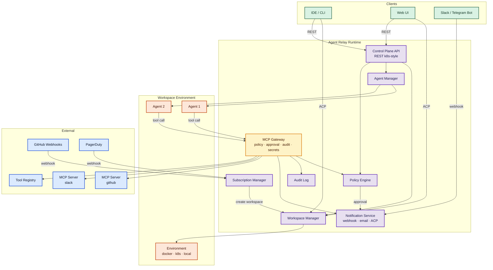

# Agent Relay Protocol

Статус: Draft
Дата: 2026-03-07

---

## 1. Problem Statement

Агенты всё чаще работают не в изоляции, а вместе с людьми — в общем коде, общих документах, общих задачах. Индустрия уже построила работающие продукты: Devin, GitHub Copilot coding agent, Cursor Cloud Agents, Factory Droids, Replit Agent. Каждый из них реализует один и тот же паттерн — **shared human/agent workspace** — но делает это по-своему, с проприетарными API и закрытыми моделями.

Сегодня есть протоколы для отдельных слоёв:
- **MCP** стандартизирует доступ к tools и контексту — и стал де-факто "tool bus" во всех зрелых agent-платформах.
- **A2A** (Google) описывает взаимодействие между агентами.
- **ACP** определяет как IDE и клиенты взаимодействуют с агентом.

Но ни один из них не отвечает на вопрос: **как создать общее рабочее пространство**, в котором люди и агенты вместе работают над задачей в контролируемой среде с общим filesystem, tools, permissions и history?

Без такого протокола каждая платформа изобретает это заново: свою модель workspace, свой способ запуска агентов, свою систему прав и approvals, свою изоляцию среды. Практика показывает, что успешные системы сходятся к одним и тем же паттернам — RBAC + runtime guardrails, async agent + human review, MCP как tool bus, checkpoints и rollbacks — но реализуют их несовместимо. Агенты оказываются привязаны к конкретной платформе. Нет переносимости, нет interoperability, нет единой модели безопасности.

Agent Relay Protocol закрывает этот gap — стандартный протокол для построения human/agent сред совместной работы. У протокола могут быть разные реализации, но благодаря общему стандарту компоненты — runtimes, agents, environments, tools — могут работать друг с другом и быть взаимозаменяемыми.

## 2. Сценарии использования

**Код.** Программист и продукт-менеджер работают над одной кодовой базой в одном workspace. В workspace работают агенты. Код смонтирован в workspace environment, приложение запущено, участники обсуждают, меняют код и тестируют результат.

**Бизнес.** Продавец и маркетолог работают над лидом в одном workspace. Агенты помогают анализировать аккаунт, CRM-данные и следующие шаги. В workspace environment — документы, заметки, CRM-контекст и tools.

**Incident Response.** На алерт создаётся workspace, подключаются on-call инженеры и агенты. Агенты тянут логи, метрики, трейсы и анализируют причину. Люди и агенты вместе дебажат и фиксят в одной среде.

**Data Analysis.** Аналитик и data engineer работают в одном workspace. Агенты помогают писать SQL, строить визуализации, проверять данные. В environment — подключение к базам, notebooks, датасеты.

**Code Review.** На pull request автоматически создаётся workspace. В него подключаются reviewers и агенты. Агенты анализируют diff, проверяют code style, ищут баги и security issues. Reviewers видят результаты анализа, обсуждают изменения с агентами и друг с другом, и принимают решение — всё в одном workspace с доступом к коду и CI.

**Pipeline.** Workspace-ы связаны в цепочку через события. PR → code review workspace эмитит `review.completed` → deploy workspace создаётся автоматически → после деплоя эмитит `deploy.completed` → monitoring workspace следит за метриками. Каждый шаг — полноценный workspace с людьми и агентами, без внешнего оркестратора.

## 3. Верхнеуровневые паттерны

Анализ существующих платформ (Devin, GitHub Copilot, Cursor, Factory, Replit) выявляет устойчивые архитектурные паттерны, которые Agent Relay кодифицирует в стандартный протокол:

**Shared artifact, не только chat.** Успешные системы строят сотрудничество вокруг конкретного артефакта — PR, branch, checkpoint, context space — а не просто чата. Workspace в Agent Relay — это и chat room, и контролируемая среда с кодом, данными и tools, привязанная к конкретной задаче или артефакту.

**Async agent + human review/handoff.** Зрелые продукты ушли от модели "человек и агент одновременно редактируют" к модели "агент работает асинхронно, человек подключается для review, approval или takeover". Agent Relay поддерживает оба режима, но approval flow и notification channels оптимизированы именно для async-паттерна.

**RBAC + runtime guardrails.** Безопасность не через prompting, а через реальные контроли: team roles, org policies, network restrictions, approval gates, sandboxes. В Agent Relay это Policy, Grant, Approval и MCP Gateway.

**MCP как tool bus.** Все зрелые платформы используют MCP для подключения внешних tools. Agent Relay не изобретает свой tool protocol, а строит MCP Gateway как авторизационный и discovery слой поверх MCP.

**Checkpoints и rollbacks.** Возможность откатить workspace к предыдущему состоянию — критически важна для безопасной работы с агентами. Agent Relay включает checkpoint/restore как часть lifecycle workspace.

**От ad-hoc диалога к явному протоколу.** Каждая платформа реализует одни и те же паттерны несовместимо. Agent Relay кодифицирует эти паттерны в открытый стандарт, делая компоненты взаимозаменяемыми.

## 4. Обзор

### 4.1 Ключевые ресурсы

| Ресурс | Описание |
|---|---|
| **Namespace** | Изоляция и tenancy. Все ресурсы принадлежат namespace. Quotas, billing. |
| **User** | Человек в системе. Identity, группы, membership в workspaces. |
| **Workspace** | Рабочее пространство — chat room + environment. Люди и агенты работают вместе. |
| **Agent** | Экземпляр агента в workspace. Ссылается на AgentHarness или описан inline. |
| **AgentHarness** | Обвязка агента: provider, модель, skills, tools. Переиспользуется. |
| **Skill** | Runtime-обвязка для Agent Skill: tools binding, suggested policies, risk tier. Content — Agent Skills spec (SKILL.md). |
| **ToolProvider** | MCP server — источник tools. Регистрируется в MCP Gateway. |
| **Policy** | Правило доступа к tools: кто, что, эффект (allow / deny / approval_required). |
| **Grant** | Делегирование конкретного права: once, temporary, permanent. |
| **Approval** | Запрос на разрешение tool call. Создаётся runtime, отвечает approver через JWT. |
| **NotificationChannel** | Канал доставки событий: approvals, сообщения, изменения workspace. |
| **EventProvider** | Источник внешних событий: GitHub webhooks, PagerDuty, cron. |
| **Subscription** | На событие из EventProvider → создать workspace по шаблону. |
| **WorkspaceTemplate** | Шаблон workspace для автоматического создания. |
| **Checkpoint** | Снимок состояния workspace. Rollback, clone, восстановление. |
| **CustomResourceDefinition** | Определение custom resource. Расширение спецификации без изменения core. |
| **AuditEntry** | Запись в audit log: who, what, when, where, result. Immutable. |

### 4.2 Архитектура

Протокол разделён на два слоя:

- **Control plane (Agent Relay API)** — управление ресурсами: workspaces, agents, grants, policies. REST API в стиле Kubernetes.
- **Data plane (ACP)** — взаимодействие внутри workspace: сообщения, tool calls, streaming. Workspace выставляет ACP endpoint.

Relay отвечает за "что существует и кто имеет доступ". ACP отвечает за "что происходит внутри".



### 4.3 Ключевые компоненты

- **Control Plane API** — REST API для управления ресурсами.
- **Workspace Manager** — создание, запуск, остановка workspaces и environments. Выставляет ACP endpoint.
- **Agent Manager** — lifecycle агентов: запуск, остановка, health check.
- **MCP Gateway** — единая точка доступа к tools. Policy check, approval, secret injection, audit, rate limiting, proxying на MCP servers. Включает registry для discovery.
- **Policy Engine** — вычисление эффективных permissions. Allow/deny/approval_required.
- **Notification Service** — доставка событий и approval requests через webhook, email, ACP.
- **Subscription Manager** — обработка внешних событий, создание workspaces по шаблонам.
- **Audit Log** — immutable лог всех действий.

### 4.4 Workspace

Workspace — главное рабочее пространство. С одной стороны — chat room, в котором люди и агенты общаются. С другой — контролируемая среда с общим filesystem, tools, code и data.

Environment — вложенная часть workspace: runtime backend (docker, k8s, local), filesystem, mounts, network policy, secrets. Environment имеет собственный lifecycle — можно перезапустить без пересоздания workspace.

Workspace имеет стабильную identity, которая включает namespace. Формат: `workspace.namespace@host`. Например: `payments-debug.acme-corp@relay.example.com`. Identity уникальна глобально и используется для grants, audit trail, membership, ACP endpoint и внешних ссылок. ACP endpoint строится из identity: `acp://payments-debug.acme-corp@relay.example.com`.

Workspace может подписываться на внешние события через EventProvider. События приходят в workspace как сообщения в чат — агенты видят их и могут реагировать. Например, workspace подписан на GitHub push events: при новом коммите агент получает сообщение, запускает тесты и отписывает результат. Это позволяет workspace быть не только пассивным пространством, но и реактивной средой.

#### Workspace как event producer

Workspace не только получает события, но и эмитит их. Исходящие события генерируются автоматически (lifecycle changes) и явно (агент или человек эмитит событие через API).

Типы исходящих событий:
- **lifecycle** — `workspace.started`, `workspace.stopped`, `workspace.failed`, `workspace.completed`
- **agent** — `agent.started`, `agent.stopped`, `agent.completed`
- **custom** — произвольные события, эмитированные агентом: `review.done`, `tests.passed`, `deploy.ready`

Completion event может нести payload — результат работы, артефакты, ссылки:

```yaml
kind: WorkspaceEvent
metadata:
  workspace: pr-review-42
  timestamp: "2026-03-07T15:00:00Z"
spec:
  type: workspace.completed
  payload:
    result: approved
    summary: "No critical issues found, 2 minor suggestions"
    artifacts:
      - type: report
        url: /workspaces/pr-review-42/artifacts/review.md
```

Исходящие события workspace доступны другим через тот же механизм EventProvider/Subscription. Это позволяет строить **цепочки workspaces** без внешнего оркестратора:

```
PR opened → [code-review workspace] → review.completed → [deploy workspace] → deploy.completed → [monitoring workspace]
```

Каждый шаг — полноценный workspace с людьми, агентами и tools. Связка — через события.

#### History

История сообщений workspace — это ACP-артефакт. Формат сообщений, streaming, context compaction — ответственность ACP и агента. Relay отвечает только за **persistence и доступ**: history хранится пока workspace существует (включая Stopped и Archived), удаляется вместе с workspace.

Relay предоставляет read-only API к истории для UI, поиска и экспорта.

#### Checkpoints & Snapshots

Workspace поддерживает checkpoints — снимки состояния environment (filesystem, databases, conversation context). Checkpoints создаются автоматически (перед опасными операциями, по расписанию) или вручную.

Операции:
- **Checkpoint** — создать снимок текущего состояния workspace.
- **Rollback** — откатить workspace к предыдущему checkpoint.
- **Clone** — создать новый workspace из checkpoint существующего. Полезно для параллельных экспериментов, debugging или передачи контекста другой команде.

Правила по умолчанию:
- Один environment на workspace.
- Участники видят одну filesystem view.
- Доступ к tools явный и revocable.
- Права workspace-scoped, не глобальные.

### 4.5 MCP Gateway

Агент никогда не вызывает MCP server напрямую. Все tool calls проходят через MCP Gateway:

```
Agent → ACP → MCP Gateway → MCP Server / HTTP API / builtin
```

На каждый tool call gateway выполняет:
1. **Policy check** — проверяет permissions.
2. **Approval** — если нужно, создаёт Approval и ждёт ответа.
3. **Secret injection** — подставляет credentials. Агент не видит токены.
4. **Audit** — логирует вызов, параметры, результат.
5. **Rate limiting** — ограничивает частоту.
6. **Proxying** — проксирует на backend.

Gateway также отвечает за **discovery**: каталог MCP servers, поиск tools по имени, тегам, capabilities.

### 4.6 Skills

Skill — runtime-обвязка для Agent Skills. Формат skill content (SKILL.md, instructions, scripts, references) определяется [Agent Skills spec](https://agentskills.io) — открытым стандартом от Anthropic, принятым Microsoft, OpenAI, Cursor, GitHub и другими. Agent Relay не изобретает свой формат instructions, а добавляет то, чего нет в Agent Skills: **tools binding, permissions и runtime policy**.

Skill в Agent Relay связывает:
- **Content** — ссылка на Agent Skills пакет (SKILL.md) или inline.
- **Tools** — какие tools нужны skill для работы.
- **Policies** — suggested permissions и risk tier.

AgentHarness ссылается на skills по имени. При активации агент получает SKILL.md content через progressive disclosure (Agent Skills spec), а Relay автоматически подключает нужные tools и применяет suggested policies.

### 4.7 Permissions & Approvals

Доступ к tools контролируется через **Policy** — кто (subject), к чему (tools), с каким эффектом (allow, deny, approval_required).

#### Risk tiers

Tools классифицируются по уровню риска. Policy может ссылаться на risk tier вместо перечисления отдельных tools:

- **low** — read-only операции, поиск, чтение файлов. Default: `allow`.
- **medium** — запись файлов, создание PR, отправка сообщений. Default: `approval_required`.
- **high** — shell execution, deploy, удаление данных, network access. Default: `deny`.

Risk tier задаётся при регистрации tool в ToolProvider. Policy может override default для любого tier. Это позволяет не писать policy на каждый tool, а задать разумные defaults по классу риска.

#### Policy hierarchy

Policies наследуются сверху вниз: **namespace → workspace**. Нижний уровень может только **ужесточать** политику верхнего, но не ослаблять. Namespace admin задаёт baseline — workspace owner может добавить ограничения, но не снять существующие.

Например, если namespace policy запрещает `shell.execute` для агентов — workspace policy не может разрешить это. Но workspace может дополнительно запретить `fs.write`, даже если namespace его разрешает.

#### Approval flow

1. Агент вызывает tool → policy требует approval → runtime создаёт Approval (Pending).
2. Runtime генерирует JWT token и доставляет notification через NotificationChannel (Slack, email, ACP).
3. Approver видит запрос с полным контекстом, отвечает через REST с JWT: `PUT /approvals/{id}?token={jwt}&decision=approve`.
4. Runtime верифицирует JWT, возобновляет tool call.

JWT одноразовый, подписан ключом runtime. Approval имеет TTL — при timeout default deny или escalation.

**Grant** — делегирование прав с режимами: `once` (одноразовый), `temporary` (с expiration), `permanent`.

### 4.8 Events & Subscriptions

Workspaces создаются автоматически на внешние события:

- **EventProvider** — источник событий (GitHub webhooks, PagerDuty, cron). Runtime выставляет endpoint для каждого provider.
- **WorkspaceTemplate** — шаблон workspace с environment, agents, members, policies.
- **Subscription** — связка: событие + фильтр → создать workspace по шаблону.

Два режима: создать новый workspace (Subscription) или доставить событие в уже живой workspace (event routing).

### 4.9 Notifications

NotificationChannel доставляет события workspace до пользователей вне ACP-подключения: approval requests, сообщения от агентов, изменения workspace, agent status. Типы каналов: webhook, email, ACP event.

### 4.10 Authentication

Runtime не реализует OAuth/OIDC login flow — только валидирует токены от внешнего OIDC provider. Аналогично Kubernetes.

**Люди** аутентифицируются через OIDC. Клиент (IDE, Web UI, CLI) получает JWT от OIDC provider (Keycloak, Google, Azure AD и т.д.) и передаёт в `Authorization: Bearer {token}`. Runtime валидирует подпись и извлекает identity из claims (email, sub, groups).

**Агенты** получают ServiceAccount tokens — JWT, выпущенные самим runtime. Token scoped к конкретному workspace и имеет ограниченные permissions. Агент не проходит OAuth flow — runtime генерирует token при запуске агента.

**Runtime config:**

```yaml
kind: RuntimeConfig
spec:
  auth:
    oidc:
      issuerUrl: https://auth.example.com
      clientId: relay-runtime
      usernameClaim: email
      groupsClaim: groups
    serviceAccounts:
      issuer: https://relay.example.com
      signingKey: runtime-key
```

Все запросы к API и ACP должны содержать валидный token. `GET /apis/relay/v1/whoami` возвращает текущий subject и его эффективные права.

### 4.11 Custom Resources

Спецификация определяет core resources (Workspace, Agent, Policy и т.д.), но runtime открыт для расширения. Любой может определить свои ресурсы через `CustomResourceDefinition` — аналогично CRD в Kubernetes.

Custom resource получает полный API автоматически: CRUD, watch, валидация по schema. Может быть глобальным или workspace-scoped. Core механизмы (audit, RBAC, watch) работают с custom resources так же, как с core.

```yaml
kind: CustomResourceDefinition
metadata:
  name: projects.example.com
spec:
  group: example.com
  names:
    kind: Project
    plural: projects
  scope: workspace
  schema:
    spec:
      type: object
      properties:
        repo: { type: string }
        language: { type: string }
        ci: { type: string }
```

После регистрации CRD можно создавать ресурсы:

```yaml
kind: Project
metadata:
  name: payments
  workspace: payments-debug
spec:
  repo: github.com/org/payments
  language: typescript
  ci: github-actions
```

API: `/apis/example.com/v1/workspaces/{name}/projects/{project}`

Custom resources глубоко интегрированы с системой permissions. Policy может ссылаться на custom resources так же, как на tools — можно контролировать кто имеет право создавать, читать, обновлять и удалять конкретные custom resources:

```yaml
kind: Policy
metadata:
  name: only-owners-manage-projects
  workspace: payments-debug
spec:
  subject: role:member
  resources: ["projects.*"]
  effect: deny
  except:
    - subject: role:owner
      effect: allow
```

Это позволяет строить domain-specific расширения (Project, Task, Pipeline, Deployment) без изменения core спецификации. Каждое расширение автоматически получает CRUD API, watch, audit, и полный RBAC.

### 4.12 Namespaces

Namespace — уровень изоляции и tenancy. Аналогично Kubernetes namespaces. Все ресурсы (workspaces, agents, policies, grants, templates и т.д.) принадлежат namespace.

Namespace обеспечивает:
- **Изоляция** — ресурсы одного namespace не видны из другого.
- **RBAC** — права можно выдавать на уровне namespace (например, admin всего namespace).
- **Quotas** — лимиты на ресурсы per namespace (workspaces, agents, storage).
- **Billing** — namespace = единица тарификации.

```yaml
kind: Namespace
metadata:
  name: acme-corp
spec:
  displayName: Acme Corporation
  admins:
    - alice@acme.com
  quotas:
    maxWorkspaces: 50
    maxAgentsPerWorkspace: 10
```

API prefix: `/apis/relay/v1/namespaces/{ns}/workspaces/...`

Для простых инсталляций можно использовать один namespace `default` — система работает как сейчас, без лишней сложности.

```
POST   /apis/relay/v1/namespaces                   — создать namespace
GET    /apis/relay/v1/namespaces                   — список namespaces
GET    /apis/relay/v1/namespaces/{ns}              — получить namespace
PUT    /apis/relay/v1/namespaces/{ns}              — обновить namespace
DELETE /apis/relay/v1/namespaces/{ns}              — удалить namespace
```

### 4.13 Audit

Все действия логируются: tool calls, permission changes, member changes, agent lifecycle. Audit log immutable и queryable. Каждая запись: who, what, when, where, result, context.

### 4.14 Security Model

Безопасность Agent Relay строится на **deterministic controls**, а не на prompt steering. LLM рассматривается как powerful but untrusted component — безопасность обеспечивается архитектурой, а не инструкциями агенту.

#### Принципы

- **Default deny** — агент не имеет доступа к tools пока не выдан явный grant или policy.
- **Deterministic enforcement** — все проверки выполняются MCP Gateway и Policy Engine, а не LLM.
- **Least privilege** — агент получает минимальные права, необходимые для задачи. ServiceAccount token scoped к workspace.
- **Policy hierarchy** — namespace policy не может быть ослаблена workspace policy.
- **Audit everything** — все tool calls, approvals, permission changes логируются immutably.

#### Threat model

**1. Prompt injection через shared context.**
Агент читает данные из workspace (файлы, сообщения, events) — malicious content может содержать инструкции. Защита: MCP Gateway проверяет permissions на каждый tool call независимо от того, что "попросил" агент. Policy Engine не доверяет intent агента, а проверяет action.

**2. Data exfiltration.**
Агент может попытаться отправить данные наружу через tool calls (HTTP запросы, shell commands, MCP servers). Защита: network policy на уровне environment (egress allowlist, default-deny), risk tier `high` для network-accessing tools, audit log для обнаружения.

**3. Tool abuse / destructive execution.**
Агент может выполнить деструктивные операции: удаление файлов, drop database, force push. Защита: risk tiers (high-risk tools требуют approval или denied by default), checkpoints для rollback, approval flow для опасных операций.

**4. Privilege escalation.**
Агент может попытаться получить права выше выданных: через другого агента, через tool который даёт доступ к secrets, через workspace event manipulation. Защита: каждый агент имеет изолированный ServiceAccount token, secrets не доступны агентам напрямую (secret injection через gateway), policy hierarchy предотвращает ослабление.

---

## 5. Ресурсы

API построен в стиле Kubernetes: декларативные ресурсы с `kind`, `metadata`, `spec`, `status`. Стандартные HTTP методы для CRUD. Watch через SSE.

```
GET    /apis/relay/v1/{resources}              — list
POST   /apis/relay/v1/{resources}              — create
GET    /apis/relay/v1/{resources}/{name}        — get
PUT    /apis/relay/v1/{resources}/{name}        — update
DELETE /apis/relay/v1/{resources}/{name}        — delete
GET    /apis/relay/v1/{resources}?watch=true    — watch changes (SSE)
```

### 5.1 User

```yaml
kind: User
metadata:
  name: alice
spec:
  email: alice@example.com
  displayName: Alice Smith
  groups:
    - backend-team
    - approvers
```

```
POST   /apis/relay/v1/users                     — создать user
GET    /apis/relay/v1/users                     — список users
GET    /apis/relay/v1/users/{name}              — получить user
PUT    /apis/relay/v1/users/{name}              — обновить user
DELETE /apis/relay/v1/users/{name}              — удалить user
GET    /apis/relay/v1/users/{name}/workspaces   — workspaces пользователя
```

### 5.2 Workspace

```yaml
kind: Workspace
metadata:
  name: payments-debug
  namespace: acme-corp
  identity: payments-debug.acme-corp@relay.example.com
spec:
  environment:
    backend: docker
    workingDir: /workspace
    mounts:
      - source: git://github.com/org/payments
        target: /workspace/code
        mode: rw
    networkPolicy: restricted
    secrets:
      - name: github-token
status:
  phase: Running
  environment:
    phase: Running
  acpEndpoint: acp://payments-debug.acme-corp@relay.example.com
```

```
POST   /apis/relay/v1/workspaces                           — создать workspace
GET    /apis/relay/v1/workspaces                           — список workspaces
GET    /apis/relay/v1/workspaces/{name}                    — получить workspace
PUT    /apis/relay/v1/workspaces/{name}                    — обновить workspace
DELETE /apis/relay/v1/workspaces/{name}                    — удалить workspace
GET    /apis/relay/v1/workspaces/{name}/status             — статус workspace
PUT    /apis/relay/v1/workspaces/{name}/environment/start  — запустить environment
PUT    /apis/relay/v1/workspaces/{name}/environment/stop   — остановить environment
GET    /apis/relay/v1/workspaces?watch=true                — watch изменений
```

#### History

Read-only API к ACP-истории workspace.

```
GET    /apis/relay/v1/workspaces/{name}/messages                — история сообщений
GET    /apis/relay/v1/workspaces/{name}/messages?author={a}&type={t}&from={ts}&to={ts}&q={search} — фильтрация и поиск
```

#### Events (outgoing)

Workspace эмитит события — lifecycle и custom. Агенты и внешние системы могут подписываться на них.

```
POST   /apis/relay/v1/workspaces/{name}/events               — эмитировать событие
GET    /apis/relay/v1/workspaces/{name}/events               — список событий
GET    /apis/relay/v1/workspaces/{name}/events?watch=true    — подписка на события (SSE)
```

Workspace как EventProvider для других subscriptions:

```yaml
kind: Subscription
metadata:
  name: deploy-after-review
spec:
  provider: workspace://pr-review-*
  filter:
    type: workspace.completed
    payload.result: approved
  template: auto-deploy
  naming: "deploy-{{ event.workspace }}"
```

#### Checkpoints

```yaml
kind: Checkpoint
metadata:
  name: before-migration
  workspace: payments-debug
spec:
  description: "Snapshot before running DB migration"
  auto: false
status:
  createdAt: "2026-03-07T14:00:00Z"
  size: 256Mi
```

```
POST   /apis/relay/v1/workspaces/{name}/checkpoints              — создать checkpoint
GET    /apis/relay/v1/workspaces/{name}/checkpoints              — список checkpoints
GET    /apis/relay/v1/workspaces/{name}/checkpoints/{cp}         — получить checkpoint
DELETE /apis/relay/v1/workspaces/{name}/checkpoints/{cp}         — удалить checkpoint
POST   /apis/relay/v1/workspaces/{name}/checkpoints/{cp}/rollback — откатить к checkpoint
POST   /apis/relay/v1/workspaces/{name}/checkpoints/{cp}/clone    — создать новый workspace из checkpoint
```

#### Event Subscriptions

Подписка workspace на события из EventProvider. События доставляются как сообщения в workspace.

```
POST   /apis/relay/v1/workspaces/{name}/eventsubscriptions              — подписаться на события
GET    /apis/relay/v1/workspaces/{name}/eventsubscriptions              — список подписок
DELETE /apis/relay/v1/workspaces/{name}/eventsubscriptions/{sub}        — отписаться
```

```yaml
kind: WorkspaceEventSubscription
metadata:
  workspace: payments-debug
spec:
  provider: github-org
  filter:
    event: push
    ref: refs/heads/main
```

#### Members

```yaml
kind: Member
metadata:
  workspace: payments-debug
spec:
  subject: alice@example.com
  role: owner
```

```
POST   /apis/relay/v1/workspaces/{name}/members              — добавить участника
GET    /apis/relay/v1/workspaces/{name}/members              — список участников
DELETE /apis/relay/v1/workspaces/{name}/members/{subject}    — убрать участника
```

Роли: `owner`, `member`, `viewer`, `approver`. Доступ через direct assignment или group.

### 5.3 Agents

#### AgentHarness

Переиспользуемый шаблон агента.

```yaml
kind: AgentHarness
metadata:
  name: code-reviewer
spec:
  provider: anthropic/claude-code
  model: claude-sonnet-4-20250514
  skills:
    - code-review
    - security-audit
  tools:
    - shell
    - file-read
    - file-write
  maxTokens: 16000
```

Skills приносят instructions (SKILL.md content) и suggested tools/policies. Harness может добавить дополнительные tools поверх тех, что требуют skills.

#### Agent

Экземпляр агента в workspace. Ссылается на AgentHarness или описан inline.

```yaml
kind: Agent
metadata:
  name: reviewer
  workspace: payments-debug
spec:
  harness: code-reviewer
status:
  phase: Running
```

Inline вариант (без отдельного AgentHarness):

```yaml
kind: Agent
metadata:
  name: helper
  workspace: payments-debug
spec:
  provider: anthropic/claude-code
  model: claude-sonnet-4-20250514
  systemPrompt: "You are a helpful assistant."
status:
  phase: Running
```

```
POST   /apis/relay/v1/workspaces/{name}/agents               — добавить агента
GET    /apis/relay/v1/workspaces/{name}/agents               — список агентов
GET    /apis/relay/v1/workspaces/{name}/agents/{agent}       — получить агента
DELETE /apis/relay/v1/workspaces/{name}/agents/{agent}       — убрать агента
PUT    /apis/relay/v1/workspaces/{name}/agents/{agent}/start — запустить агента
PUT    /apis/relay/v1/workspaces/{name}/agents/{agent}/stop  — остановить агента
```

AgentHarness API:

```
POST   /apis/relay/v1/agentharnesses                           — создать harness
GET    /apis/relay/v1/agentharnesses                           — список harnesses
GET    /apis/relay/v1/agentharnesses/{name}                    — получить harness
PUT    /apis/relay/v1/agentharnesses/{name}                    — обновить harness
DELETE /apis/relay/v1/agentharnesses/{name}                    — удалить harness
```

### 5.4 Skills

```yaml
kind: Skill
metadata:
  name: code-review
spec:
  source: github://org/skills/code-review    # Agent Skills пакет (SKILL.md)
  tools:
    - fs.read
    - github.pr.comment
    - github.pr.review
  policies:
    - effect: allow
      tools: [fs.read, github.pr.*]
    - effect: approval_required
      tools: [github.pr.merge]
  suggestedRisk: low
```

Inline skill (без внешнего пакета):

```yaml
kind: Skill
metadata:
  name: quick-test-runner
spec:
  description: "Run tests and report results"
  instructions: |
    Run the project test suite. Report failures with file and line.
    If all tests pass, summarize coverage.
  tools:
    - shell.execute
    - fs.read
  policies:
    - effect: allow
      tools: [shell.execute]
      params:
        command: ["npm test", "pytest", "go test ./..."]
  suggestedRisk: medium
```

```
POST   /apis/relay/v1/skills                           — создать skill
GET    /apis/relay/v1/skills                           — список skills
GET    /apis/relay/v1/skills/{name}                    — получить skill
PUT    /apis/relay/v1/skills/{name}                    — обновить skill
DELETE /apis/relay/v1/skills/{name}                    — удалить skill
```

### 5.5 Tools & MCP Gateway

#### ToolProvider

MCP server — источник tools.

```yaml
kind: ToolProvider
metadata:
  name: github
spec:
  type: mcp
  endpoint: mcp://github-mcp-server
  tools:
    - name: create_pr
      description: Create a pull request
      requiredPermission: github.pr.create
    - name: list_issues
      description: List repository issues
      requiredPermission: github.issues.read
```

```yaml
kind: ToolProvider
metadata:
  name: shell
spec:
  type: builtin
  tools:
    - name: execute
      description: Execute shell command
      requiredPermission: shell.execute
      risk: high
    - name: read_file
      description: Read file contents
      requiredPermission: fs.read
      risk: low
    - name: write_file
      description: Write file contents
      requiredPermission: fs.write
      risk: medium
```

#### Gateway API

```
POST   /apis/relay/v1/gateway/servers                        — зарегистрировать MCP server
GET    /apis/relay/v1/gateway/servers                        — список MCP servers
GET    /apis/relay/v1/gateway/servers/{name}                 — получить MCP server
DELETE /apis/relay/v1/gateway/servers/{name}                 — удалить MCP server
GET    /apis/relay/v1/gateway/tools?q={query}                — поиск tools
```

Подключение к workspace:

```
POST   /apis/relay/v1/workspaces/{name}/servers              — подключить MCP server
GET    /apis/relay/v1/workspaces/{name}/servers              — список подключённых
DELETE /apis/relay/v1/workspaces/{name}/servers/{server}     — отключить MCP server
GET    /apis/relay/v1/workspaces/{name}/tools                — все tools workspace
```

### 5.6 Permissions

#### Policy

```yaml
kind: Policy
metadata:
  name: agents-need-approval-for-shell
  workspace: payments-debug
spec:
  subject: role:agent
  tools: ["shell.*"]
  effect: approval_required
  approvers: [role:owner]
```

```yaml
kind: Policy
metadata:
  name: everyone-can-read
  workspace: payments-debug
spec:
  subject: "*"
  tools: ["fs.read", "github.issues.read"]
  effect: allow
```

Risk tier policy — defaults для всех tools по классу риска:

```yaml
kind: Policy
metadata:
  name: risk-defaults
  namespace: acme-corp
spec:
  subject: role:agent
  riskTier: low
  effect: allow
---
kind: Policy
metadata:
  name: risk-defaults-medium
  namespace: acme-corp
spec:
  subject: role:agent
  riskTier: medium
  effect: approval_required
  approvers: [role:member]
---
kind: Policy
metadata:
  name: risk-defaults-high
  namespace: acme-corp
spec:
  subject: role:agent
  riskTier: high
  effect: deny
```

Namespace-level policies наследуются всеми workspaces и не могут быть ослаблены:

```
POST   /apis/relay/v1/namespaces/{ns}/policies             — namespace policy
GET    /apis/relay/v1/namespaces/{ns}/policies             — список namespace policies
```

```
POST   /apis/relay/v1/workspaces/{name}/policies             — создать policy
GET    /apis/relay/v1/workspaces/{name}/policies             — список policies
GET    /apis/relay/v1/workspaces/{name}/policies/{policy}    — получить policy
PUT    /apis/relay/v1/workspaces/{name}/policies/{policy}    — обновить policy
DELETE /apis/relay/v1/workspaces/{name}/policies/{policy}    — удалить policy
```

#### Grant

```yaml
kind: Grant
metadata:
  name: alice-shell-access
  workspace: payments-debug
spec:
  subject: alice@example.com
  permission: shell.execute
  mode: permanent
  grantedBy: alice@example.com
```

```
POST   /apis/relay/v1/workspaces/{name}/grants             — создать grant
GET    /apis/relay/v1/workspaces/{name}/grants             — список grants
DELETE /apis/relay/v1/workspaces/{name}/grants/{grant}     — отозвать grant
GET    /apis/relay/v1/workspaces/{name}/grants/effective?subject={subject} — эффективные права
```

#### Approval

```yaml
kind: Approval
metadata:
  name: approval-123
  workspace: payments-debug
spec:
  requestedBy: agents/claude
  action: tool.call
  tool: shell.execute
  params: { command: "npm test" }
  policy: agents-need-approval-for-shell
  context: "Agent wants to run tests"
  expiresAt: "2026-03-07T15:00:00Z"
status:
  phase: Pending | Approved | Denied | Expired
  respondedBy: alice@example.com
  respondedAt: "2026-03-07T14:32:00Z"
```

```
GET    /apis/relay/v1/workspaces/{name}/approvals            — список pending approvals
GET    /apis/relay/v1/workspaces/{name}/approvals/{id}       — получить approval
PUT    /apis/relay/v1/workspaces/{name}/approvals/{id}       — ответить (approve/deny)
```

#### Approval flow: пример

Агент `claude` хочет выполнить `shell.execute("npm run migration")`. Policy требует approval от `role:owner`.

1. Агент вызывает tool → MCP Gateway проверяет policies → match: `approval_required`.
2. Runtime создаёт Approval (Pending), генерирует JWT для каждого approver.
3. Notification через каналы: ACP event, Slack webhook, email со ссылкой.
4. Alice видит: "Agent claude wants to run `npm run migration`. Approve?"
5. Alice отвечает → `PUT /approvals/approval-123?token=eyJ...&decision=approve`.
6. Runtime верифицирует JWT, approval → Approved, tool call возобновляется.
7. Всё записывается в audit log.

### 5.7 Notifications

```yaml
kind: NotificationChannel
metadata:
  name: slack-ops
  workspace: payments-debug
spec:
  type: webhook
  endpoint: https://slack-bot.example.com/relay
  events: [approval.requested, agent.status_changed]
  targets: [role:owner]
```

```yaml
kind: NotificationChannel
metadata:
  name: alice-messages
  workspace: payments-debug
spec:
  type: email
  events: [message.created]
  targets: [alice@example.com]
  config:
    templateUrl: https://relay.example.com/workspace/{workspace}/messages
```

Типы событий: `approval.requested`, `message.created`, `agent.status_changed`, `workspace.updated`, `*`.

### 5.8 Events & Subscriptions

#### EventProvider

```yaml
kind: EventProvider
metadata:
  name: github-org
spec:
  type: webhook
  path: /hooks/github-org
  secret: github-webhook-secret
```

```yaml
kind: EventProvider
metadata:
  name: daily-check
spec:
  type: cron
  schedule: "0 9 * * 1-5"
  event: { type: "cron.tick", name: "daily-check" }
```

```
POST   /apis/relay/v1/eventproviders                         — создать event provider
GET    /apis/relay/v1/eventproviders                         — список event providers
GET    /apis/relay/v1/eventproviders/{name}                  — получить event provider
DELETE /apis/relay/v1/eventproviders/{name}                  — удалить event provider
```

Каждый webhook-based provider получает endpoint: `POST /hooks/{provider-name}`.

#### WorkspaceTemplate

```yaml
kind: WorkspaceTemplate
metadata:
  name: code-review
spec:
  environment:
    backend: docker
    workingDir: /workspace
    mounts:
      - source: "{{ event.repository.clone_url }}"
        target: /workspace/code
        mode: rw
  agents:
    - harness: code-reviewer
  members:
    - subject: "{{ event.pull_request.user.login }}@github.com"
      role: member
    - subject: backend-team
      role: reviewer
  servers:
    - github
  policies:
    - agents-read-only-by-default
```

```
POST   /apis/relay/v1/templates                              — создать template
GET    /apis/relay/v1/templates                              — список templates
GET    /apis/relay/v1/templates/{name}                       — получить template
PUT    /apis/relay/v1/templates/{name}                       — обновить template
DELETE /apis/relay/v1/templates/{name}                       — удалить template
```

#### Subscription

```yaml
kind: Subscription
metadata:
  name: pr-review
spec:
  provider: github-org
  filter:
    event: pull_request
    action: opened
  template: code-review
  naming: "pr-{{ event.pull_request.number }}"
```

```
POST   /apis/relay/v1/subscriptions                          — создать subscription
GET    /apis/relay/v1/subscriptions                          — список subscriptions
GET    /apis/relay/v1/subscriptions/{name}                   — получить subscription
PUT    /apis/relay/v1/subscriptions/{name}                   — обновить subscription
DELETE /apis/relay/v1/subscriptions/{name}                   — удалить subscription
```

### 5.9 Audit

```yaml
kind: AuditEntry
metadata:
  workspace: payments-debug
  timestamp: "2026-03-07T14:30:00Z"
spec:
  subject: agents/claude
  action: tool.call
  tool: shell.execute
  params: { command: "npm test" }
  policy: agents-need-approval-for-shell
  approval: { approver: alice@example.com, decision: approved }
  result: success
```

```
GET    /apis/relay/v1/workspaces/{name}/audit                — audit log
GET    /apis/relay/v1/workspaces/{name}/audit?subject={subject}&action={action}&from={ts}&to={ts} — фильтрация
```

---

## 6. Data Plane: ACP

Для взаимодействия внутри workspace используется ACP. Когда workspace запущен, он выставляет ACP endpoint (в `status.acpEndpoint`). Участники подключаются к нему для:

- Отправки сообщений агентам
- Получения ответов и streaming
- Tool calls внутри workspace environment
- Чтения history

ACP используется как subspec — Agent Relay не переопределяет формат сообщений, а делегирует это ACP.

### Пример flow

1. `POST /apis/relay/v1/workspaces` — создали workspace (Relay API)
2. Runtime запускает environment и агентов
3. `GET /apis/relay/v1/workspaces/payments-debug` — получили `status.acpEndpoint`
4. Человек подключается к `acp://payments-debug@relay.example.com` — это ACP
5. Внутри ACP — общение с агентами, tool calls, history

---

## 7. Lifecycle

### Workspace phases

```
Pending --> Starting --> Running --> Stopping --> Stopped --> Archived
                   \        |                \
                    \       |-- checkpoint     \--> Failed
                     \      |-- rollback
                      \--> Failed
```

В состоянии Running workspace может создавать checkpoints и откатываться к ним. Clone создаёт новый workspace (Pending) из checkpoint любого workspace (включая Stopped/Archived).

Environment имеет собственный lifecycle (те же phases). Можно перезапустить без пересоздания workspace.

### Agent phases

```
Pending --> Starting --> Running --> Stopping --> Stopped
                   \                       \
                    \--> Failed              \--> Failed
```

---

## 8. Errors

Стандартные HTTP status codes:

| Code | Описание |
|---|---|
| 400 | Невалидный запрос |
| 401 | Не аутентифицирован |
| 403 | Нет доступа |
| 404 | Ресурс не найден |
| 409 | Конфликт состояния |
| 429 | Превышена квота |

```json
{ "kind": "Status", "code": 403, "reason": "Forbidden", "message": "subject alice@example.com does not have permission shell.execute" }
```

---

## 9. Watch Events

Доставляются через SSE при `?watch=true`. Формат:

```json
{ "type": "ADDED | MODIFIED | DELETED", "object": { "kind": "...", "metadata": {}, "spec": {}, "status": {} } }
```

---

## 10. Runtime API

```
GET    /apis/relay/v1/health     — статус runtime
GET    /apis/relay/v1/whoami     — текущий пользователь и его права
```

---

## Open Questions

- ~~**Multi-tenancy / Organizations**~~ — решено через Namespace (см. 3.12).
- **Secrets management** — как хранятся, ротируются, кто имеет доступ к secrets в environment. Нужен ли отдельный Secret ресурс или интеграция с Vault/KMS.
- ~~**History / Conversation model**~~ — решено: history это ACP-артефакт, Relay хранит и даёт read-only API (см. 4.4, 5.2).
- **Agent-to-agent communication** — могут ли агенты внутри workspace общаться друг с другом напрямую или только через shared environment и ACP.
- ~~**Persistence / Snapshots**~~ — решено через Checkpoint (см. 4.4, 5.2).
- **Quotas & Limits** — лимиты на ресурсы: workspaces, агенты, tool calls, storage, compute per workspace/user/org.
- **API versioning** — стратегия эволюции API, backwards compatibility, deprecation policy.

---

## Bottom Line

Agent Relay Protocol — стандартный API для создания workspace и запуска агентов в общей контролируемой среде, где люди подключаются, делегируют доступы и безопасно работают вместе с агентами.
